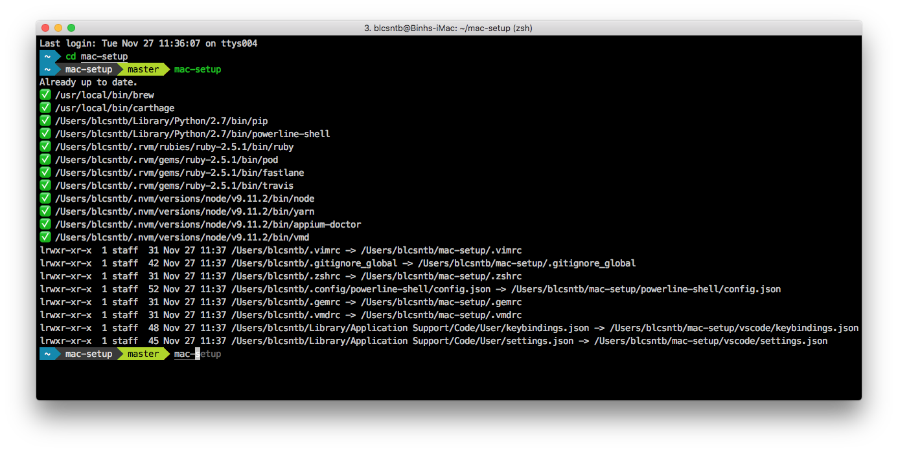

[](https://travis-ci.org/blcsntb/mac-setup)



# Getting Started

## Install

Install the latest Xcode command line tools:

```
xcode-select --install
```

Install *mac-setup* using curl

```
curl https://raw.githubusercontent.com/blcsntb/mac-setup/master/mac-setup | bash -s all && source ~/.zshrc
```

## Update

```
mac-setup
```
